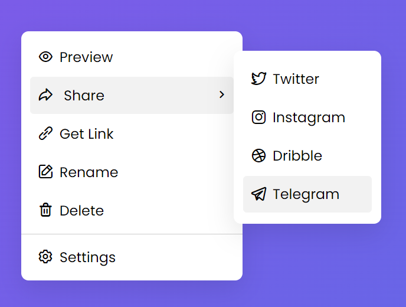

# Custom Right Click Context Menu in HTML CSS & Javascript

This is a simple custom context menu that can be accessed by right-clicking inside the page and disappears when left-clicked inside the page. Within the selections, it can also have sub-menus. Here is a link to the preview: https://htmlpreview.github.io/?https://github.com/AmerAsyrafSalleh/Custom-Right-Click-Context-Menu-in-HTML-CSS-and-Javascript/blob/main/index.html

This context menu consists of 3 files to function:

```
  1.  index.html
  2.  style.css
  3.  script.js
```

##  index.html

HTML is a text-based approach to describing how content contained within an HTML file is structured. This file sets up on how the menu will look like (with content) on the page.

A class is a space-separated list of the classes of the element. Classes allows CSS and JavaScript to select and access specific elements via the class selectors or functions like the method Document.getElementsByClassName(). The .html file has several class used:

  1.  wrapper - Specifies how the text in a text area is to be wrapped when submitted in a form.
  2.  content - Gives the value associated with the http-equiv or name attribute.
  3.  menu    - Appears upon user interaction, such as a right-click. HTML now allows us to customize this menu.
  4.  item    - List down the items the user can interact within the menu.

The html code should be constructed as per below:

```html
<!DOCTYPE html>
<html>
    <head>
        <meta charset="utf-8">
        <title>
            Custom Context Menu
        </title>
        <link rel="stylesheet" href="style.css">
        <meta name="viewport" content="width=device-width, initial-scale=1.0">
        <link rel="stylesheet" href="https://unicons.iconscout.com/release/v4.0.0/css/line.css">
    </head>
    <body>
        <div class="wrapper">
            <div class="content">
                <ul class="menu">
                    <li class="item">
                        <i class="uil uil-eye"></i>
                        <span>Preview</span>
                    </li>
                    <li class="item share">
                        <div>
                            <i class="uil uil-share"></i>
                            <span>Share</span>
                        </div>
                        <i class="uil uil-angle-right"></i>
                        <ul class="share-menu">
                            <li class="item">
                                <i class="uil uil-twitter-alt"></i>
                                <span>Twitter</span>
                            </li>
                            <li class="item">
                                <i class="uil uil-instagram"></i>
                                <span>Instagram</span>
                            </li>
                            <li class="item">
                                <i class="uil uil-dribbble"></i>
                                <span>Dribble</span>
                            </li>
                            <li class="item">
                                <i class="uil uil-telegram-alt"></i>
                                <span>Telegram</span>
                            </li>
                        </ul>
                    </li>
                    <li class="item">
                        <i class="uil uil-link-alt"></i>
                        <span>Get Link</span>
                    </li>
                    <li class="item">
                        <i class="uil uil-edit"></i>
                        <span>Rename</span>
                    </li>
                    <li class="item">
                        <i class="uil uil-trash-alt"></i>
                        <span>Delete</span>
                    </li>
                </ul>
                <div class="setting">
                    <li class="item">
                        <i class="uil uil-setting"></i>
                        <span>Settings</span>
                    </li>
                </div>
            </div>
        </div>
        <script src="script.js"></script>
    </body>
</html>
```

##  style.css

CSS stands for 'Cascading Style Sheets'. CSS describes how HTML elements are to be displayed on screen, paper, or in other media. CSS saves a lot of work. It can control the layout of multiple web pages all at once. External stylesheets are stored in CSS files.

With proper consideration for formatting and a sprinkle of a bit of creativity, one could come up with a context menu looking like this one below:



First off, we style the fonts to be used for this interface. Any existing fonts are suitable to use. However, I choose to import a font provided by GoogleAPI. These are the choices of formats below:

```css
@import url('https://fonts.googleapis.com/css2?family=Poppins:wght@400;500;600;700&display=swap');
*{
    margin: 0;
    padding: 0;
    box-sizing: border-box;
    font-family: 'Poppins', sans-serif;
}
```

Next, we move on with styling the body tag:

```css
body
{
    min-height: 100vh;
    background: linear-gradient(135deg, #8855E9 0%, #5D6BE6 100%);

}
```

Then, we style the wrapper that holds our app, and make it hidden from the start so that it only pops up only when you right-click on it:

```css
.wrapper
{
    position: absolute;
    visibility: hidden;
    width: 300px;
    background: #fff;
    border-radius: 10px;
    box-shadow: 0 12px 35px rgba(0,0,0,0.1);
}

.wrapper .menu
{
    padding: 10px 12px;
}
```

The contents are sized properly within the wrappers, and shows the pointer cursor when you hover the mouse onto the items. the background of the contents are darken when hovered. 

```css
.content .item
{
    list-style: none;
    font-size: 22px;
    height: 50px;
    display: flex;
    padding: 0 5px 0 10px;
    align-items: center;
    border-radius: 5px;
    margin-bottom: 2px;
    cursor: pointer;
    width: 100%;
}

.content .item:hover
{
    background: #f2f2f2;
}

.content .item span
{
    font-size: 19px;
    margin-left: 8px;
}

.content .setting
{
    display: flex;
    padding: 5px 12px;
    border-top: 1px solid #ccc;
    margin-top: -5px;
}

.content .share
{
    position: relative;
    justify-content: space-between;
}
```

And last but not least, we stylize the share item, as this has a sub-menu. The sub-menu must be hidden at all times until a mouse is hovering on the share item. 

```css
.share .share-menu
{
    position: absolute;
    background: #fff;
    width: 200px;
    right: -200px;
    top: -35px;
    padding: 13px;
    opacity: 0;
    pointer-events: none;
    border-radius: 10px;
    box-shadow: 0 12px 35px rgba(0,0,0,0.1);
    transition: 0.2s ease;
}

.share:hover .share-menu
{
    opacity: 1;
    pointer-events: auto;
}
```

##  script.js

JavaScript is the Programming Language for the Web. It can update and change both HTML and CSS. JavaScript can calculate, manipulate and validate data. Javascript is used by programmers to create dynamic and interactive web content like applications and browsers.

First, we set up a query using querySelector(). The Document method querySelector() returns the first Element within the document that matches the specified selector, or group of selectors. If no matches are found, null is returned.

```js
const contextMenu = document.querySelector(".wrapper");
shareMenu = contextMenu.querySelector(".share-menu");
```

The JavaScript addEventListener() method allows you to set up functions to be called when a specified event happens, such as when a user clicks a button.

```js
document.addEventListener({});
```

For the 'contextmenu' function, we want to prevent the default of the context menu show up in the page, so we use the preventDefault() function.

```js
document.addEventListener
(
    "contextmenu", e =>
    {
        e.preventDefault(); //preventing default context menu of the browser
```

We also want the menu to only appear within the page and not beyond it.

```js
        let x = e.offsetX, y = e.offsetY,
        winWidth = window.innerWidth,
        winHeight = window.innerHeight,
        cmWidth = contextMenu.offsetWidth,
        cmHeight = contextMenu.offsetHeight;
```

If we right-click on the near right side of the page, the share sub-menu will be hard to see. Therefore we use an 'if else' statement by determining whether x (which is assigned to e.offsetX) is greater than the (window width - contextMenu width - shareMenu width), it move the shareMenu to the left side. Else, the shareMenu is shown on the right side.

```js
        //If x is greater than window width - contextMenu width - shareMenu width, then show the share menu to the left. Else, show it to the right.
        if (x > (winWidth - cmWidth - shareMenu.offsetWidth))
        {
            shareMenu.style.left = "-200px";
        }
        else
        {
            shareMenu.style.left = "";
            shareMenu.style.right = "-200px";
        }
```

We want to be able to right-click to access the context-menu at any part of the webpage window, so we introduce 2 variables that determine the position and have correct calculations for it to properly pop-up within the window's size.

```js
        //If x is greater than window width - contextMenu width then set the x value to window width - contextMenu width else set x to the offsetX. Similarly, to y. 
        x = x > winWidth - cmWidth ? winWidth - cmWidth : x;
        y = y > winHeight - cmHeight ? winHeight - cmHeight : y;

        contextMenu.style.left = `${x}px`;
        contextMenu.style.top = `${y}px`;
        contextMenu.style.visibility = "visible";
    }
);
```

Finally, to be able to hide the context menu, simply write down this code that enables the hiding by left-clicking on the webpage window screen.

```js
//Hide the context menu on document click
document.addEventListener("click", () => contextMenu.style.visibility = "hidden");
```
